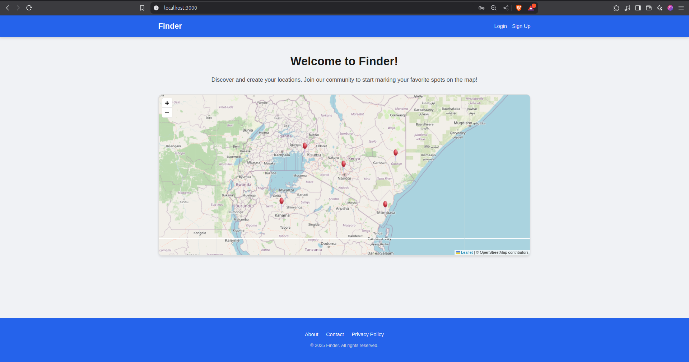
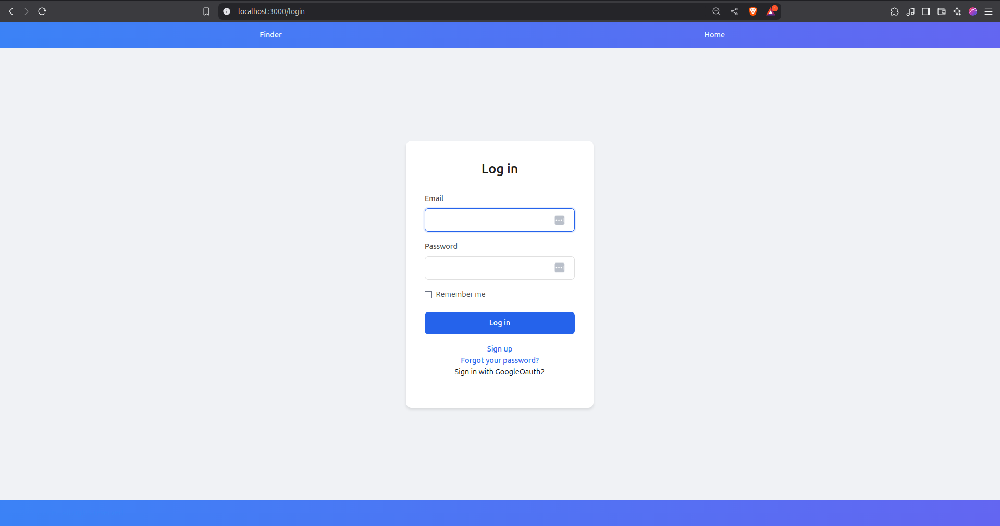
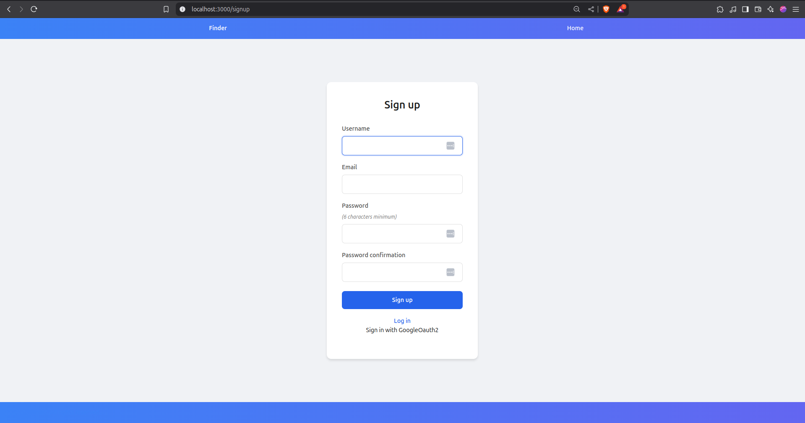
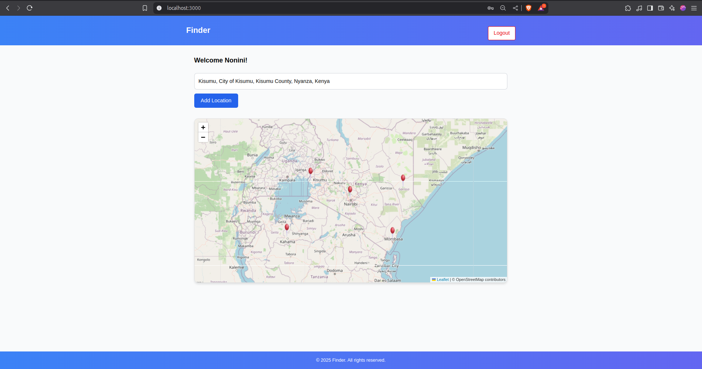
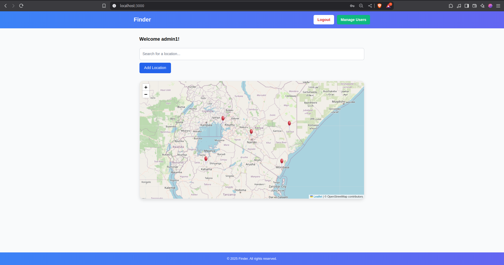
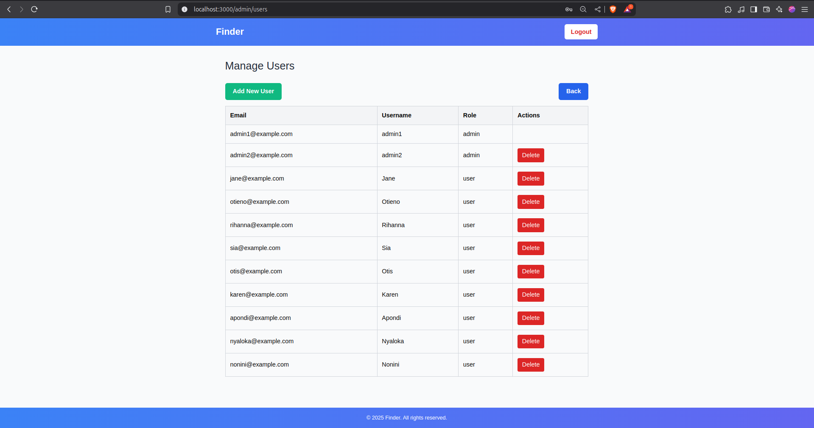
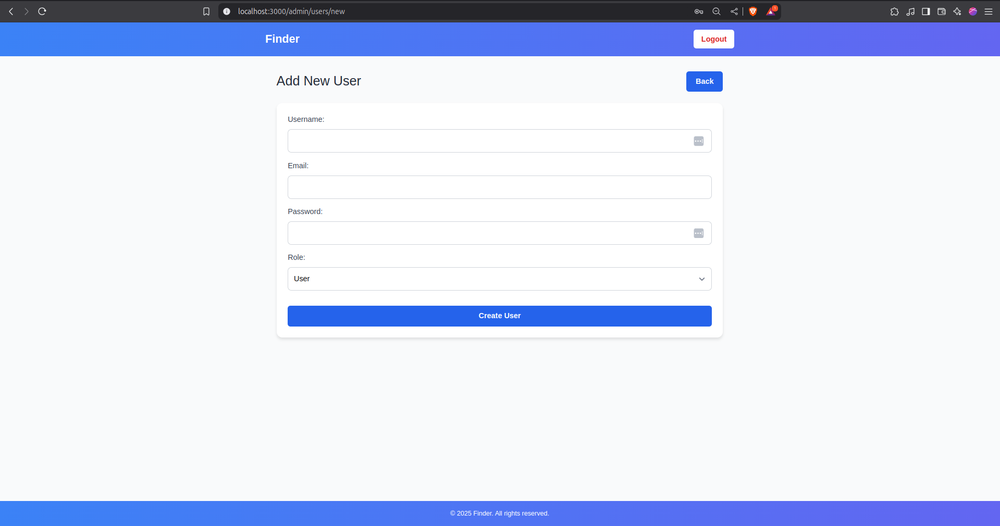

# Location Pinning App (finder)

A full-stack web application using Ruby on Rails, Inertia.js, and React that allows users to register, log in, and drop pins on a map representing locations by name, latitude, and longitude. All users can view pins from everyone on the landing page. Admin role enables user management through a dedicated dashboard.

## Core Functionality
- User authentication (sign up, log in, log out)
- Add a location 
- Interactive map view showing all user-submitted pins
- Pins displayed on the landing page
- Admin user: Can add or delete users via an admin dashboard

## Stack
- Backend: Ruby on Rails
- Frontend: React (via Inertia.js)
- Map Rendering: Leaflet.js
- Authentication: Devise 

## Getting Started

Clone the repo

```console
$ git clone https://github.com/JoabOwala/finder.git
$ cd finder
```
Install dependencies

```console
$ bundle install
$ npm install
```

Setup database

```console
$ rails db:migrate db:seed
```

Start the server

```console
$ rails s
```

## Usage

- Visit http://127.0.0.1:3000 to view the map with all locations pins
- Sign up or log in
- Once logged in, add a new location using the form
- Hover to view details

### Admin

Admin users can
- View all users
- View all locations
- Remove and add users from the system

## Screenshot

Screen Shots


1. Landing Page



2. LogIn Page



3. Sign Up



4. Users Page



5. Admin Page



6. Admin Dashboard page



7. Admin Add new user page

## License

## Contributors
- [Joab Owala](https://github.com/jowala)